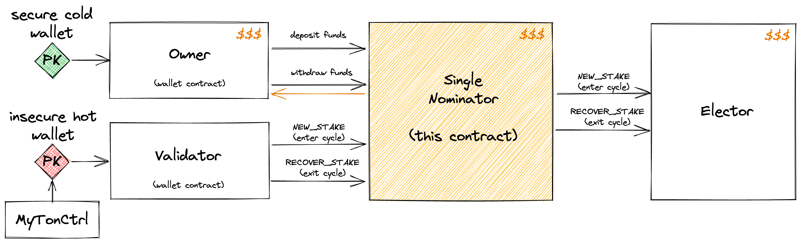
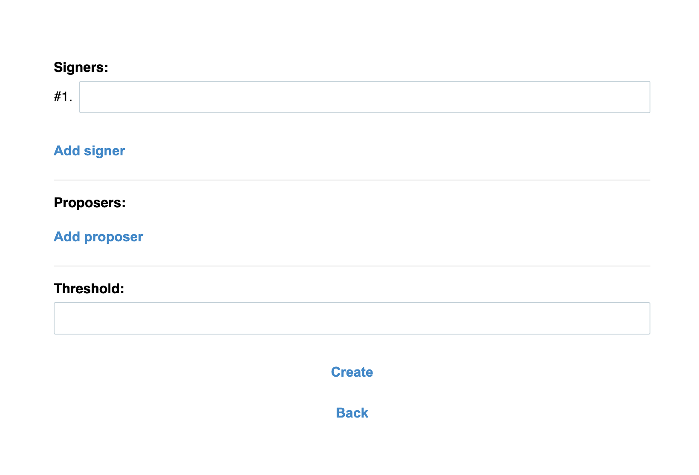
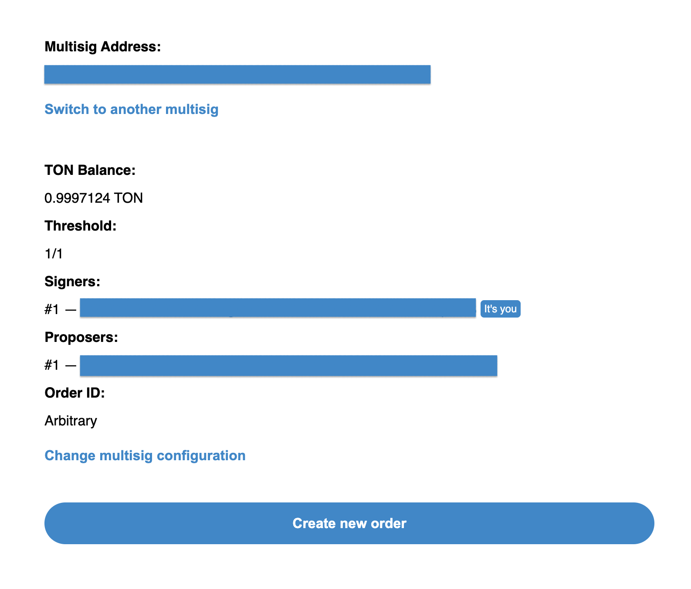
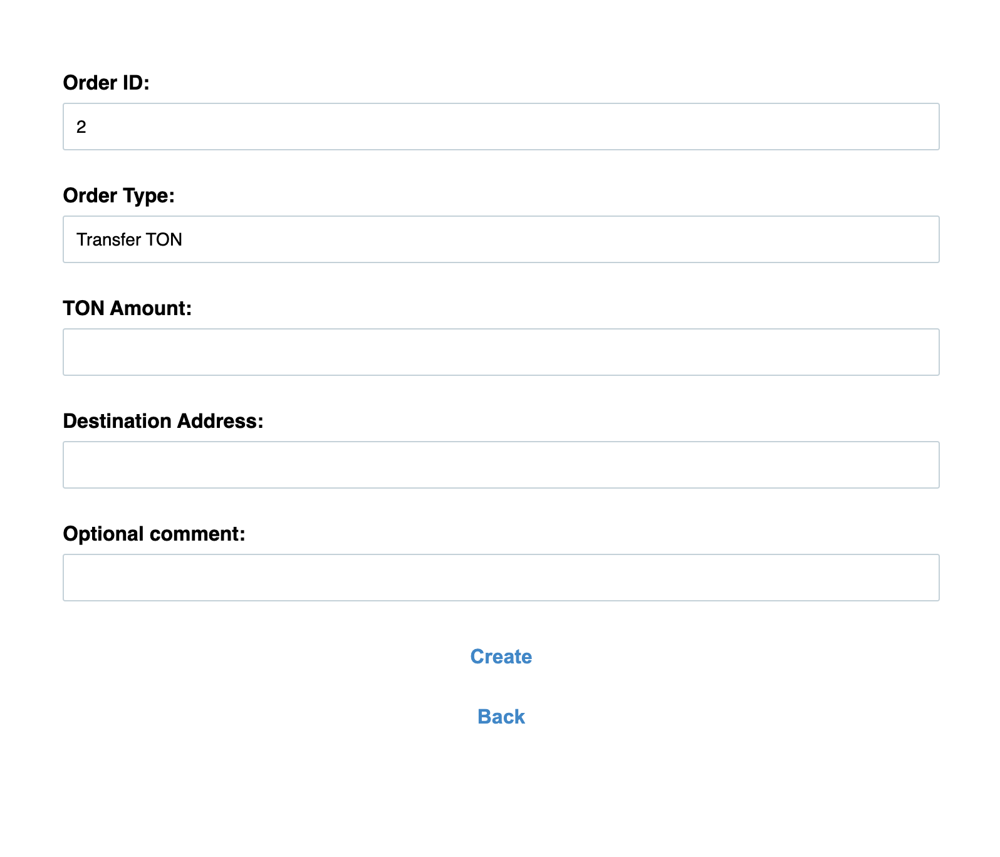
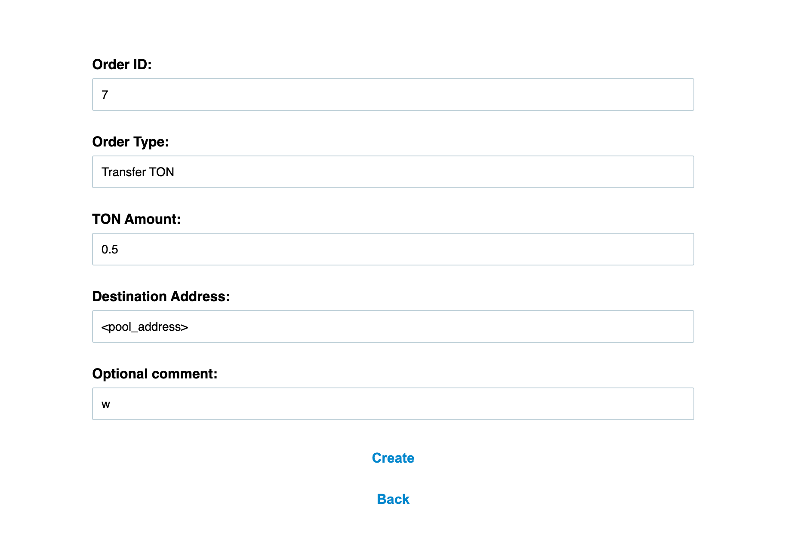
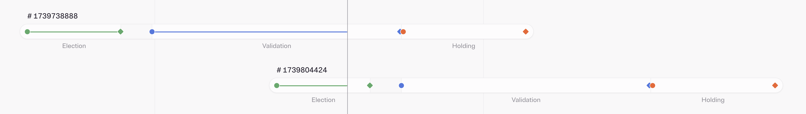
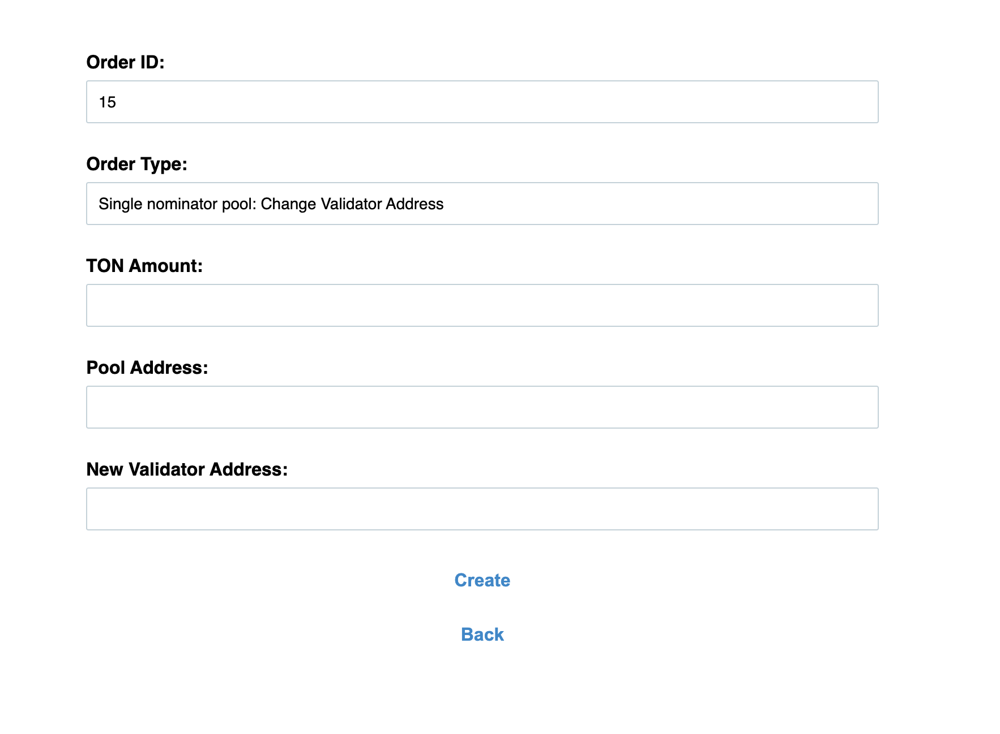

## Schematic of the Single Pool Nominator Operation

1. _Owner_ holds the funds for staking in their secure cold wallet
2. _Owner_ deposits the funds into the _SingleNominator_ contract (this contract)
3. _MyTonCtrl_ starts running on the validator node connected to the Internet
4. _MyTonCtrl_ uses the _Validator_ wallet to instruct the _SingleNominator_ to enter the next election cycle
5. _SingleNominator_ sends the stake to the _Elector_ for one cycle
6. The election cycle is over and the stake can be recovered
7. _MyTonCtrl_ uses the _Validator_ wallet to instruct the _SingleNominator_ to recover the stake from the election cycle
8. _SingleNominator_ recovers the stake of the previous cycle from the _Elector_
9. Steps 4–8 repeat as long as the _Owner_ is happy to keep validating
10. _Owner_ withdraws the funds from the _SingleNominator_ contract and takes them back home



## Installation Instructions

To manage the validator, you need to create a multisig wallet — it allows you to control the actions of the single pool only when consensus is reached.

To create a multisig contract, go to [https://multisig.ton.org/](https://multisig.ton.org/) and log in using the wallet of the future multisig owner.  
It is important to ensure secure storage of the owner's keys — reserve the keys on a paper medium and use a cold wallet. With this owner wallet, you can later change the multisig settings, for example, **adding or removing signer wallets** or changing the quorum threshold.

The multisig interface allows you to set up different roles:  
**Proposers** — propose fund transfers and management operations  
**Signers** — sign transactions and vote for or against proposals.

The Threshold is the minimum number of "for" votes required to execute an operation within the multisig. The recommended value is approximately 75%.  
For example, 3 when there are 5 signers.

<figure style="text-align: center;"><figcaption> Pic 1: Сreating a multisig wallet</figcaption> </figure>


After creation, the following contract screen appears. **Be sure to save the multisig address — it will be needed when configuring the single pool server.**

<figure style="text-align: center;"> <figcaption> Pic 2: Configured mulstig</figcaption> </figure>


The validator is managed through Orders. After clicking on “Create new order,” you can top up the validator wallet or the single pool nominator wallet, or send messages to their addresses.

<figure style="text-align: center;"> <figcaption> Pic 3: Creating an order</figcaption> </figure>

## Validator Operations

### Top up the Validator Wallet Balance

To ensure uninterrupted operation, the validator node must maintain a small amount of funds to pay for gas (transaction fees).

Due to technical specifics, these funds cannot be stored 100% securely — the servers are not located in our own data centers, which means there is a hypothetical risk of encountering a dishonest data center engineer who might have physical access to the hard drive where the keys are stored.

 
> [!IMPORTANT]
> It is recommended to keep no more than 100 TON in the validator's balance while ensuring sufficient funds for processing transactions.

### Top up the Pool Balance

The main staking funds are held in the single pool wallet.

The pool is managed using a multisig wallet. No one besides it has the ability to withdraw funds from the pool contract. Before setting up the pool, it is important to perform a test transaction with a small amount (≈1–2 TON) to verify that everything works correctly and to initially link the owner's wallet to the pool contract.

### Withdrawing Funds

**Withdrawal of Validation Rewards**  
To withdraw funds, simply send a message from the multisig wallet with the text “w” to the pool address.  
It is recommended to perform this action during the initial setup to verify proper operation **before** transferring the final amount of funds.

<figure style="text-align: center;"> <figcaption> Pic 4: Withdrawal from a Pool</figcaption> </figure>

For example:
```
Order type: Transfer TON
TON Amount: 0.5
Destination address: <single_pool_address>
Optional comment: w
```

It is recommended to perform this action during the initial setup to verify proper operation **before** transferring the final amount of funds.

**Withdrawal of Staked Funds**  
When withdrawing funds, you must consider the validator’s operating principle, which is schematically depicted below:  

<figure style="text-align: center;"><figcaption> Pic 5: Network cycle</figcaption> </figure>

The network operation is divided into several stages:

- **<span style="font-weight:bold; color:rgb(50, 255, 50)">election</span>** — during this stage, validators for the next round are selected
- **<span style="font-weight:bold; color:rgb(70, 70, 255)">validation</span>** — during this stage, validators perform their work
- **<span style="font-weight:bold; color:rgb(255, 100, 50)">holding</span>** — at this point, the validator's funds remain on the Elector contract

The validator’s funds are completely locked for the entire round — from the start of <span style="font-weight:bold; color:rgb(50, 255, 50)">election</span> until the end of **<span style="font-weight:bold; color:rgb(255, 100, 50)">holding</span>**.

To withdraw staked funds, it is necessary to remove the validator from participation. This requires manual actions on the validator server and, at the moment, requires manual administrator intervention and changes to the server settings.
If necessary, please contact our support chat.

## Changing the Validator Address

In the event of force majeure situations, such as a data center failure or validator equipment malfunction, it is necessary to restore operations by transferring a backup to another server.

If access to the backup is unavailable, it is necessary to change the validator address via the multisig contract. To do this, create an Order of type “Single nominator pool: Change Validator Address,” specifying the current pool address and the new validator address.

<figure style="text-align: center;"><figcaption> Pic 6: Changing the validator’s address </figcaption> </figure>

## Setup Plan

1. Create a multisig wallet with the necessary settings
2. Reserve the multisig owner's wallet (it is advisable to have multiple copies)
3. Share the multisig wallet address in the chat; after that, the single pool nominator will be deployed and the single pool contract address will be known
4. Perform an initial top-up of the validator wallet (with a **small** amount up to 50 TON)
5. Perform an initial top-up of the single pool (with a **small** amount up to 50 TON)
6. Test the withdrawal of funds from the single pool
7. If successful, top up the pool contract with the desired amount
8. Monitor and periodically top up the validator wallet balance for transaction fees
9. Periodically withdraw the rewards for operating the validator
