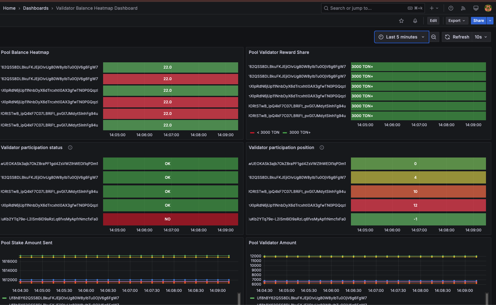

# Playbook for singlepool validators

## Components

- multisig with single pool support
- ton-validators-metrics: prometheus exporter with on-chain metrics
- grafana / prometheus
- single pool validators + mytonctrl

## Groups

- _validator-production_ – Used to deploy the validator environment (includes mytonctrl, restic backup, security
  hardening
  with fail2ban and iptables policies)
- _monitoring_ – Grafana and Prometheus for alerting and monitoring

## Configuration

ansible/group_vars – environment variables
ansible/host_vars – vaults

## How to

### Validator

```bash
chmod +x deploy-validator.sh
./deploy-validator.sh
```

**[warn]** Deploy validator may redeploy already provisioned nodes with latest backup from restic (`mtc_backup/<host>`).

### Monitoring

```bash
chmod +x deploy-monitoring.sh
./deploy-monitoring.sh
```

Validator Balance Heatmap Dashboard



#

## Setup:

Declare the necessary variables:
ansible/group_vars

monitoring.yml:

```yaml
default_user: user # The user under which mytonctrl will be installed and run
grafana_host: mon.server.tld # FQDN of the monitoring server

alert_bot_chat_id: -1000000000 # Telegram chat ID for notifications
```

Describe the required groups for hosts. As an example, let's analyze the configuration for the group validator-production.

validator-production.yml:

```yaml
default_user: user under which mytonctrl will be installed and run

crypt_name: name of the crypt container for luks
luks_container: luks mount point
container_size: size of the crypt container
mount_point: mount point of the crypt container

encrypt_paths: # List of directories to be encrypted
- "/var/ton-work/db/keyring/"
- "/var/ton-work/keys/"
- "/usr/local/bin/mytoncore/wallets/"

stake_size: "null" # set stake value for mytonctrl

alert_bot_chat_id: -1000000000 # Telegram chat ID for notifications
```
Remove the .example suffix from the configuration files and adjust the settings accordingly.

Run deploy-validator.sh for deploying the validators.
Run deploy-monitoring.sh for deploying the monitoring.